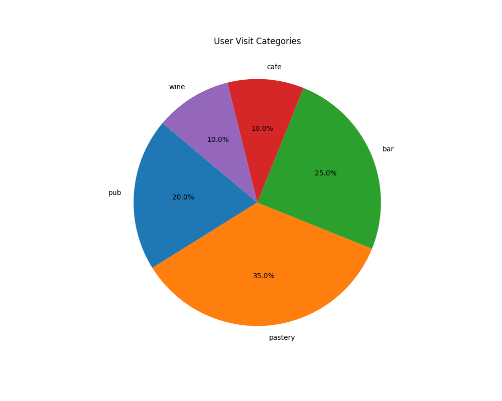

# User Location Data Analysis and Clustering

This project analyzes user location data and performs clustering based on their visiting behaviors. The project uses FastAPI for the backend and matplotlib for visualizations.

## Requirements

- Python 3.11+
- pip

## Setup

1. **Clone the repository**

   ```bash
   git clone https://github.com/kadircebel/bonjoapp-task.git
   cd your-repository
2. **Create a virtual environment**
    ```bash
    python -m venv env

    # On macOS/Linux
    .\env\Scripts\activate

    # On Windows
    source venv/bin/activate
3. **Install dependencies**
   ```bash
   pip install -r requirements.txt
4. **Run the FastAPI application**
   ```bash
   uvicorn app.main:app --reload

## Endpoints

* "**GET /cluster** " : Groups users based on their visiting behavior of different types of venues and different datetime of a month.

* "**GET /visualize**" : Visualizes user visit data over time using a pie chart.
* "**GET /weighted-cluster**" : Groups users based on their visiting behavior with a weighted mechanism where newer visits have higher weights.
* "**GET /visualize-categories**" : Categorizes users based on their visit patterns and generates visualizations for each category.

* "**GET /categorize-users**" : Identifies each user's preferences based on given qualifications.

## Data

* "**app/data/data_20.json**" : Contains user visit data for analysis.
* "**app/data/data_100.json**" : Contains a larger set of user visit data for performance testing.

## Visualizations

All generated visualizations are exported to the `visuals` directory. Make sure this directory exists or is created during the process. The visualizations include pie charts, bar charts, and other graphical representations of the user visit data.

* "**app/visuals**" : Contains user visit data for analysis.

### Example Visualizations

#### User Visit Categories


#### Clustered Users


#### Time of Day Categories


## License

[MIT](https://choosealicense.com/licenses/mit/)